# Data Flow Architecture

## Overview
This document describes how data flows through TranslatorSync, from initial CLI input through final file output. Understanding these flows is crucial for debugging, optimization, and extending the system.

## Current Data Flow (MVP)

### 1. Initialization Flow
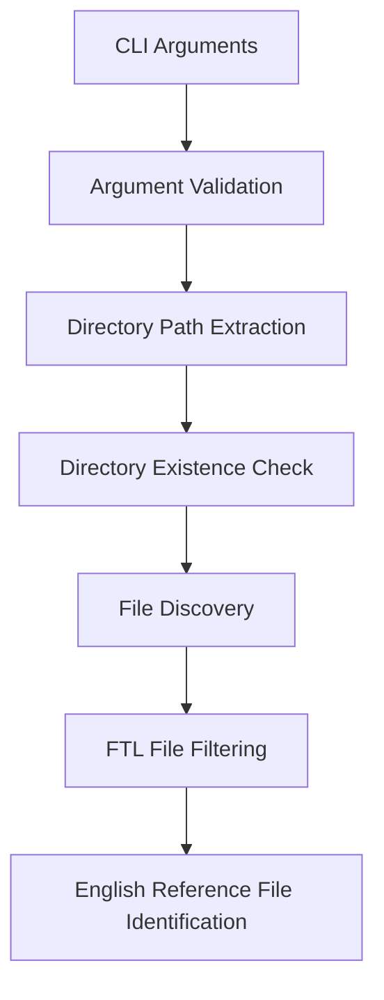

**Data Transformations:**
- `process.argv` → validated directory path
- Directory path → list of all files
- File list → filtered `.ftl` files
- FTL files → English reference + target files

### 2. Translation Processing Flow
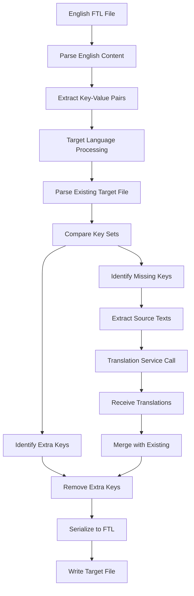

**Data Types at Each Stage:**
```typescript
// Stage B: Parsed content
Map<string, string> // key → source text

// Stage F: Key comparison
{
  missing: string[],    // keys in EN but not in target
  extra: string[],      // keys in target but not in EN
  existing: string[]    // keys present in both
}

// Stage J: Translation request
{
  sourceLang: 'en',
  targetLang: string,
  texts: string[]       // array of source texts
}

// Stage K: Translation response
Map<string, string>     // source text → translated text
```

### 3. File I/O Flow
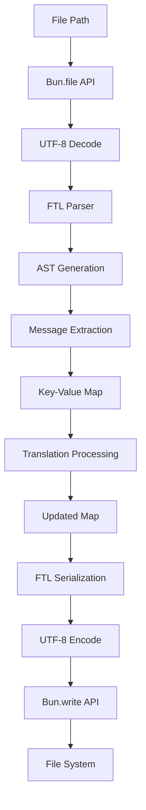

## Planned Data Flow (Production)

### 1. Enhanced Initialization
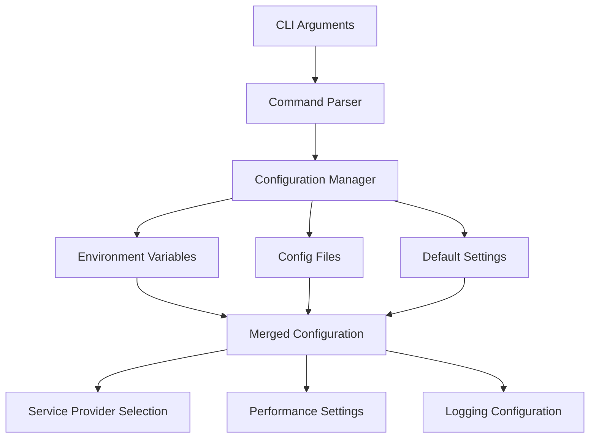

### 2. Parallel Processing Flow
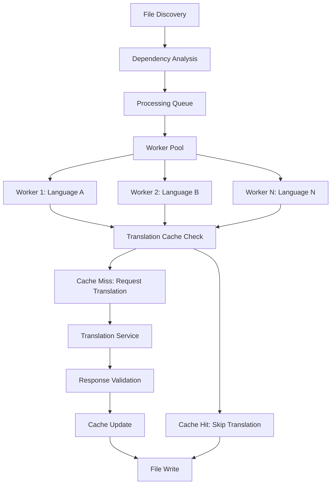

### 3. Translation Service Flow
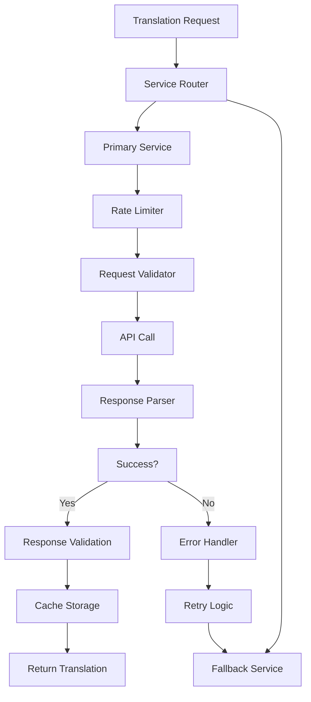

## Error Flow Patterns

### 1. File System Errors
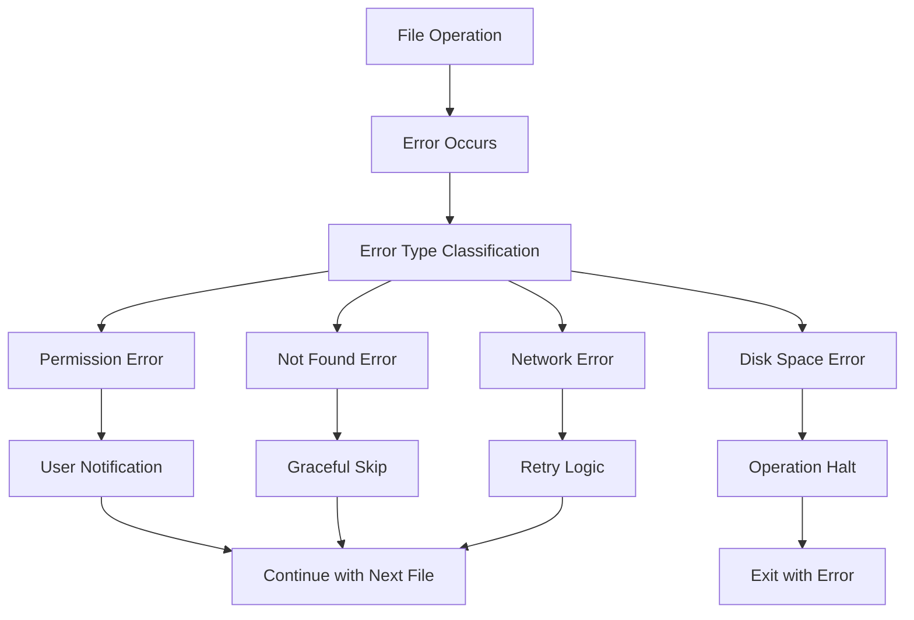

### 2. Translation Service Errors
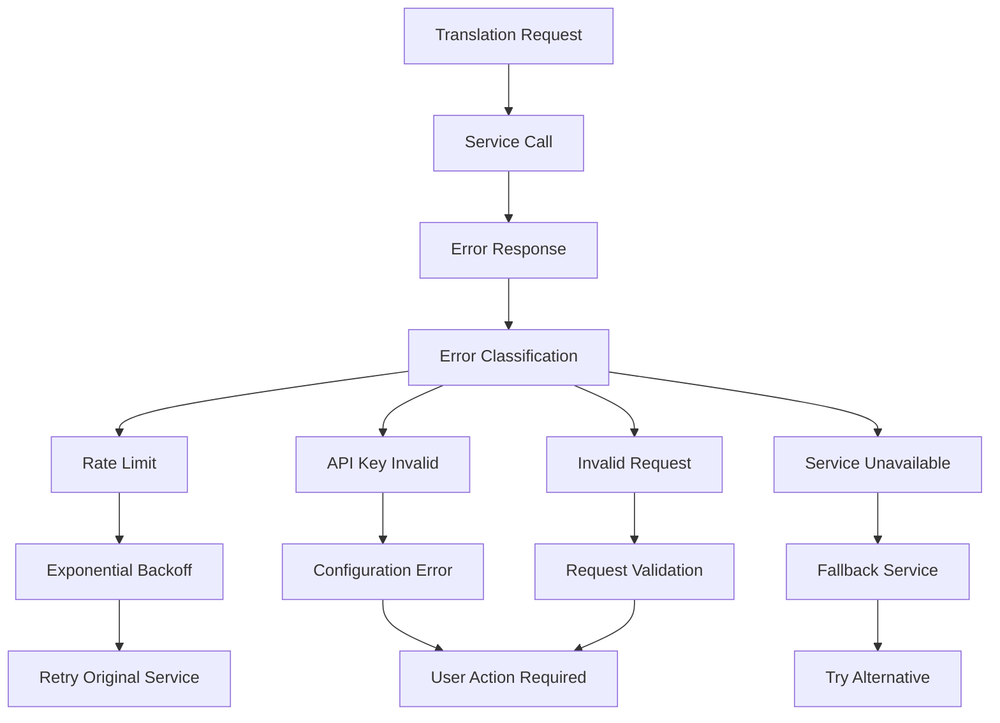

## Data Validation Points

### 1. Input Validation
```typescript
// CLI argument validation
validateDirectory(path: string): ValidationResult
validateLanguageCode(lang: string): ValidationResult
validateConfiguration(config: Config): ValidationResult
```

### 2. Content Validation
```typescript
// FTL content validation
validateFTLSyntax(content: string): ParseResult
validateTranslationKeys(keys: string[]): ValidationResult
validateUnicodeContent(text: string): ValidationResult
```

### 3. Output Validation
```typescript
// Translation result validation
validateTranslationResponse(response: APIResponse): ValidationResult
validateFileIntegrity(originalPath: string, backupPath: string): boolean
validateKeyConsistency(source: Map, target: Map): ValidationResult
```

## Performance Optimization Points

### 1. Caching Strategy
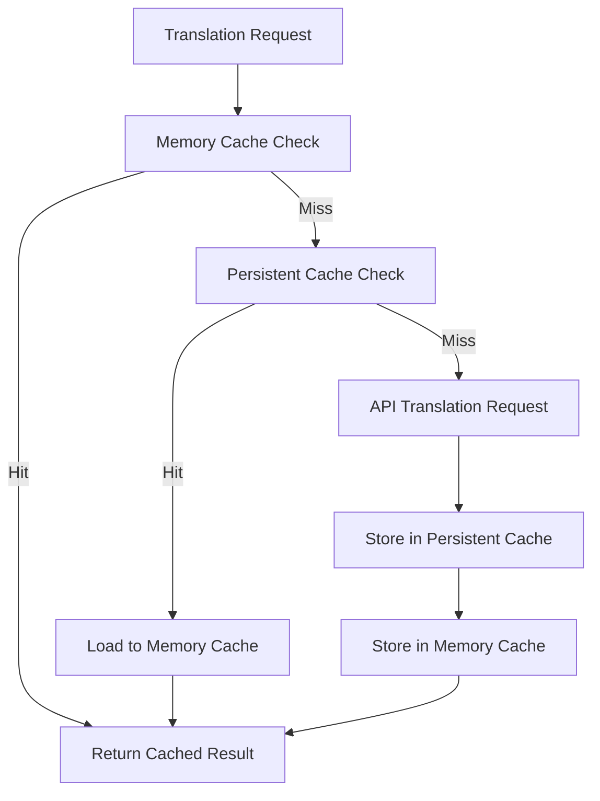

### 2. Batching Optimization
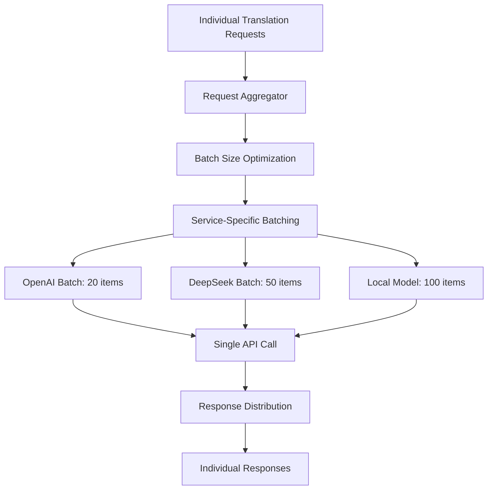

## Memory Management

### 1. Large File Handling
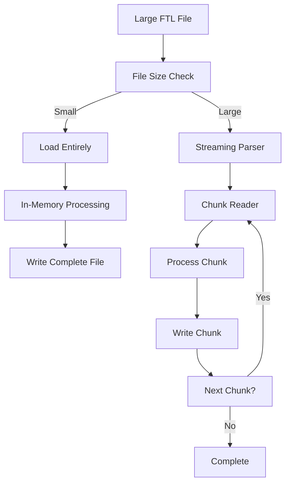

### 2. Memory Usage Patterns
```typescript
// Memory usage at different stages
interface MemoryProfile {
  initialization: '10-20MB',    // Basic CLI setup
  fileDiscovery: '20-30MB',     // File system scanning
  parsing: '50-100MB',          // FTL parsing per file
  translation: '100-200MB',     // API responses buffering
  writing: '30-50MB',           // File writing operations
  cleanup: '10-20MB'            // Back to baseline
}
```

## Security Considerations

### 1. Data Sanitization Flow
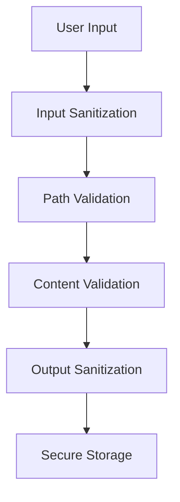

### 2. API Key Flow
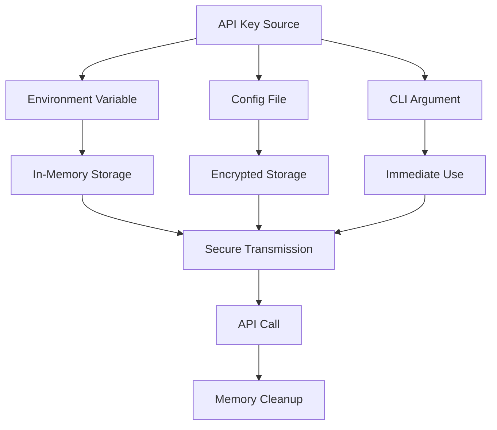

## Monitoring and Observability

### 1. Metrics Collection Points
```typescript
interface MetricsCollectionPoints {
  fileProcessing: {
    filesDiscovered: number,
    filesProcessed: number,
    filesSkipped: number,
    processingTime: number
  },
  translation: {
    requestsSent: number,
    responsesReceived: number,
    cacheHits: number,
    cacheMisses: number,
    errorRate: number
  },
  performance: {
    memoryUsage: number,
    cpuUsage: number,
    diskIO: number,
    networkIO: number
  }
}
```

### 2. Logging Data Flow
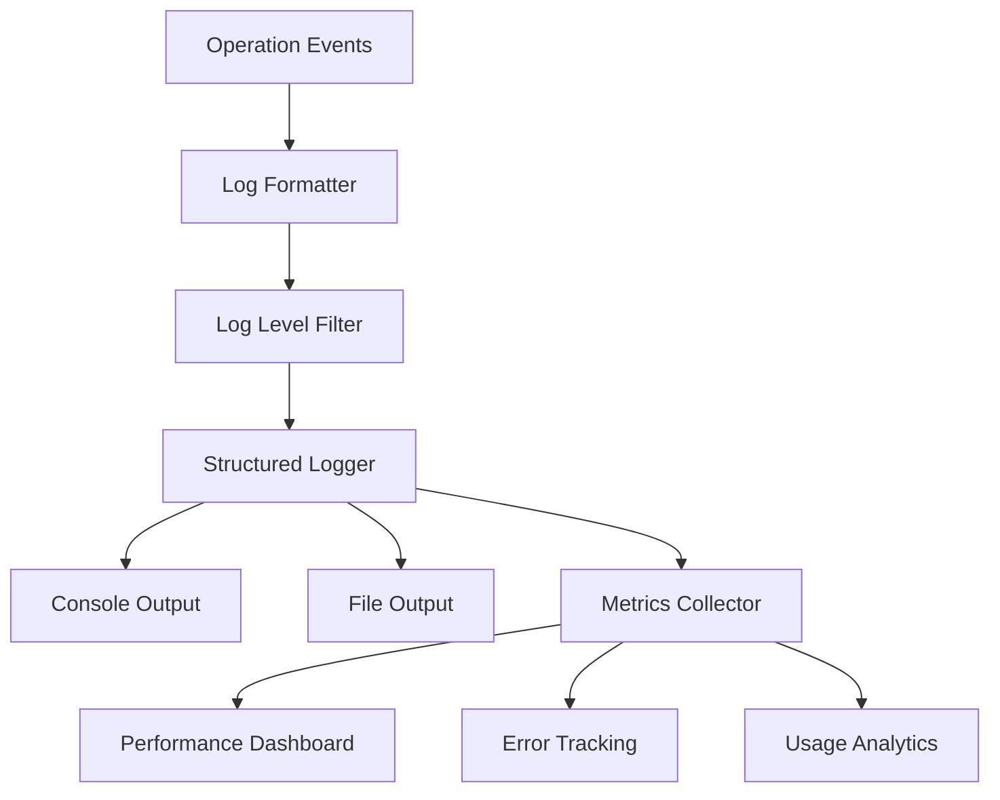

## Future Flow Enhancements

### 1. Real-time Processing
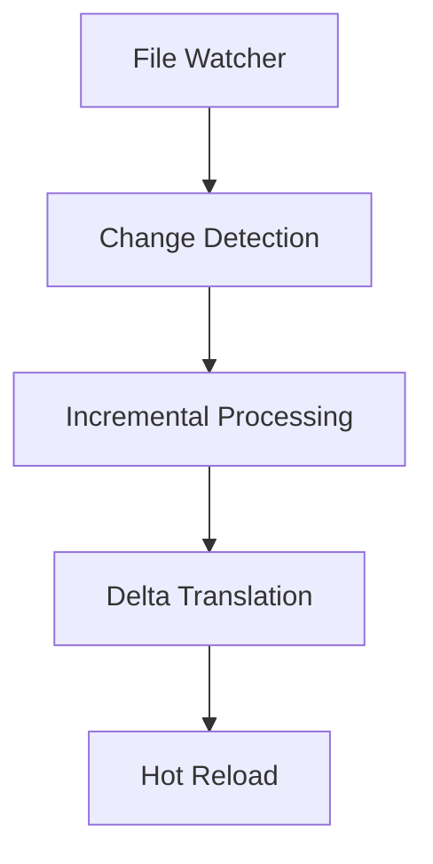

### 2. Distributed Processing
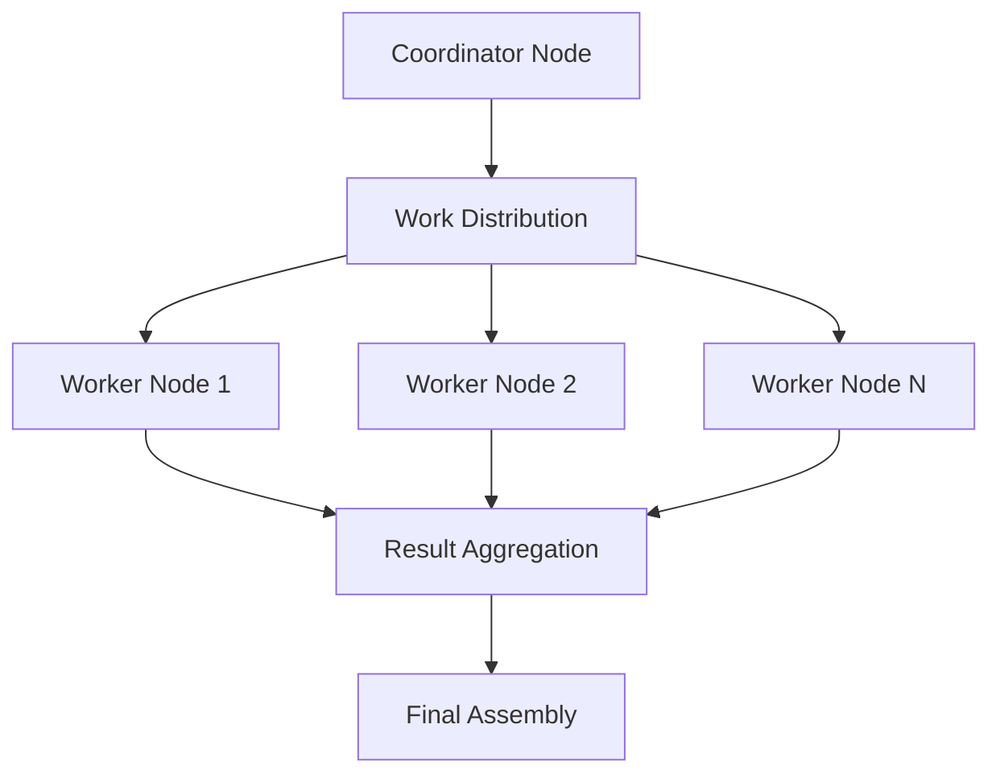

## Cross-References

- [System Design](system-design.md) - Architecture overview
- [CLI Interface](../api/cli-interface.md) - Input/output specifications
- [Translation Services](../api/translation-services.md) - Service integration details
- [Performance Guide](../troubleshooting/performance.md) - Optimization strategies