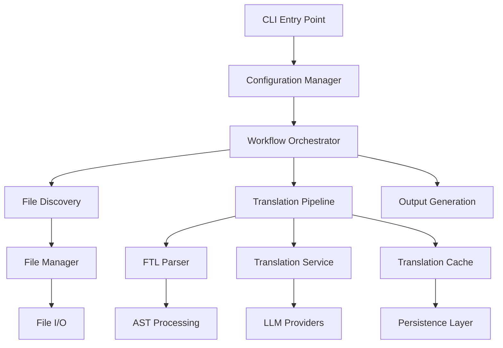

# System Design Overview

## Architecture Philosophy

TranslatorSync follows a **modular, pipeline-based architecture** designed for extensibility, testability, and performance. The system processes translation files through a series of well-defined stages, each with clear responsibilities and interfaces.

## High-Level Architecture



## Core Components

### 1. CLI Entry Point (`src/cli/index.ts`)
**Responsibility**: Command-line interface and application initialization

**Current Implementation**:
- Argument validation
- Basic error handling
- Direct orchestration of sync process

**Future Evolution**:
- Command parsing with flags support
- Help system
- Progress reporting
- Graceful shutdown handling

### 2. Configuration Manager (`src/config.ts`)
**Responsibility**: Application configuration and environment management

**Current Implementation**:
- Simple hardcoded configuration
- Primary language setting

**Planned Enhancements**:
- Environment variable support
- Config file parsing (JSON/YAML)
- Service provider configuration
- Performance tuning parameters
- Validation and schema enforcement

### 3. File Manager (`src/utils/fileManager.ts`)
**Responsibility**: File system operations and I/O abstraction

**Current Implementation**:
- Basic file reading/writing using Bun APIs
- Directory listing
- File type checking

**Architectural Benefits**:
- Abstraction over Bun file APIs
- Testable through mocking
- Centralized error handling for I/O operations

**Future Enhancements**:
- Streaming support for large files
- Concurrent file operations
- File watching capabilities
- Backup and recovery mechanisms

### 4. FTL Parser (`src/utils/ftlParser.ts`)
**Responsibility**: Fluent file format parsing and serialization

**Current Implementation**:
- Parsing FTL content to key-value maps
- Serialization back to FTL format
- Multiline value support

**Technical Details**:
- Uses `@fluent/syntax` for AST generation
- Preserves formatting and comments where possible
- Handles complex FTL features (attributes, variants)

**Performance Considerations**:
- Memory-efficient parsing for large files
- Streaming parser for very large datasets
- Caching of parsed ASTs

### 5. Translation Service (`src/services/translator.ts`)
**Responsibility**: Translation provider abstraction and implementation

**Current Implementation**:
- Interface definition for translation services
- Mock implementation for development/testing

**Architecture Pattern**: **Strategy Pattern**
- Allows swapping translation providers
- Consistent interface across all providers
- Easy testing through mocking

**Planned Providers**:
- OpenAI GPT-4
- DeepSeek
- Anthropic Claude
- OpenRouter (multi-provider access)
- Local models (Ollama integration)

## Data Flow

### Current Sync Process
```
1. CLI validates input directory
2. File Manager discovers .ftl files
3. FTL Parser processes English reference file
4. For each target language file:
   a. Parse existing translations
   b. Identify missing keys
   c. Request translations from service
   d. Merge new translations
   e. Remove extraneous keys
   f. Serialize and write updated file
```

### Future Enhanced Flow
```
1. Configuration Manager loads settings
2. Workflow Orchestrator initializes pipeline
3. File Discovery identifies all translation files
4. Translation Cache checks for existing translations
5. Batch Translation requests for efficiency
6. Validation Engine checks translation quality
7. Progress Tracker reports status
8. Error Handler manages failures and retries
9. Output Generation writes results
10. Audit Logger records operation details
```

## Architectural Decisions

### Decision 1: Bun Runtime
**Rationale**: Fast startup, native TypeScript, optimized file I/O
**Trade-offs**: Newer ecosystem, less tooling than Node.js
**Impact**: Significant performance improvements for CLI usage

### Decision 2: Interface-Driven Design
**Rationale**: Testability, extensibility, service provider flexibility
**Implementation**: `TranslationService` interface with multiple implementations
**Benefits**: Easy mocking, provider swapping, testing isolation

### Decision 3: Fluent Format Focus
**Rationale**: Mozilla's i18n standard, rich feature set, good tooling
**Future**: Plugin architecture for JSON, YAML, gettext support
**Benefits**: Standardized format, multiline support, localization features

### Decision 4: Synchronous Processing Model
**Current**: Sequential file processing
**Future**: Asynchronous pipeline with configurable concurrency
**Rationale**: Simplicity for MVP, scalability for production

## Error Handling Strategy

### Error Categories
1. **Configuration Errors**: Invalid settings, missing API keys
2. **File System Errors**: Permissions, missing files, disk space
3. **Network Errors**: API failures, timeouts, rate limits
4. **Translation Errors**: Invalid responses, quality issues
5. **Parsing Errors**: Malformed FTL files, encoding issues

### Recovery Mechanisms
- **Retry Logic**: Exponential backoff for transient failures
- **Graceful Degradation**: Continue with available services
- **Partial Success**: Save successful translations, report failures
- **Rollback**: Restore previous state on critical failures

## Performance Architecture

### Current Performance Characteristics
- **Small files (<1KB)**: ~100ms per file
- **Medium files (1-100KB)**: ~500ms per file
- **Memory usage**: Proportional to largest file
- **Concurrency**: Single-threaded processing

### Target Performance (Production)
- **Throughput**: 1000+ small files per minute
- **Latency**: <100ms startup time
- **Memory**: Constant usage regardless of file size
- **Concurrency**: Configurable parallel processing

### Optimization Strategies
1. **Streaming**: Process large files without loading entirely into memory
2. **Batching**: Group translation requests to minimize API overhead
3. **Caching**: Avoid re-translating unchanged content
4. **Parallelization**: Concurrent file processing with rate limiting

## Security Considerations

### API Key Management
- Environment variable storage
- Config file encryption
- In-memory only during execution
- No logging of sensitive data

### File System Security
- Input validation for file paths
- Prevention of directory traversal
- Backup creation before modifications
- Atomic file operations

### Network Security
- HTTPS-only API communication
- Certificate validation
- Request/response validation
- Rate limiting respect

## Extensibility Points

### Translation Providers
**Interface**: `TranslationService`
**Extension**: Implement interface for new providers
**Configuration**: Provider-specific settings in config

### File Formats
**Future Interface**: `FileFormatHandler`
**Extension**: Support for JSON, YAML, gettext
**Strategy**: Plugin-based architecture

### CLI Commands
**Future Interface**: `CommandHandler`
**Extension**: Additional commands (validate, analyze, etc.)
**Pattern**: Command pattern with help system

## Monitoring and Observability

### Logging Strategy
- **Structured logging**: JSON format for parsing
- **Log levels**: DEBUG, INFO, WARN, ERROR
- **Contextual information**: Operation ID, file paths, timing
- **Performance metrics**: Processing time, API response times

### Metrics Collection
- **Throughput**: Files processed per minute
- **Success rate**: Percentage of successful operations
- **API usage**: Request counts, response times, costs
- **Error rates**: By category and severity

## Testing Architecture

### Unit Testing
- **Pure functions**: FTL parsing, configuration validation
- **Mocked dependencies**: File I/O, API calls
- **Edge cases**: Error conditions, boundary values

### Integration Testing
- **End-to-end workflows**: Complete sync operations
- **File system integration**: Real file operations with temp directories
- **Service integration**: Mock API responses

### Performance Testing
- **Benchmarks**: Processing time for various file sizes
- **Memory profiling**: Memory usage patterns
- **Stress testing**: Large numbers of files

## Future Architecture Evolution

### Phase 1: Enhanced CLI (Weeks 3-4)
- Command-line flag support
- Configuration file system
- Progress reporting

### Phase 2: Performance Optimization (Weeks 5-6)
- Streaming file processing
- Concurrent operations
- Translation caching

### Phase 3: Production Features (Weeks 7-8)
- Multiple translation providers
- Advanced error handling
- Comprehensive logging

### Phase 4: Ecosystem Integration (Future)
- Git hooks integration
- CI/CD pipeline support
- Web dashboard
- API server mode

## Cross-References

- [Architectural Decisions](decisions/README.md) - Detailed ADRs
- [Data Flow Diagram](data-flow.md) - Detailed process flow
- [Development Plan](../development-plan.md) - Implementation roadmap
- [API Documentation](../api/README.md) - Interface specifications
- [Testing Strategy](../development/testing.md) - Testing approach